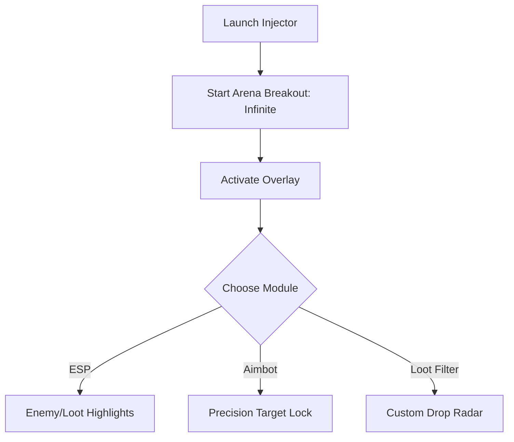

# Arena Breakout: Infinite Cheat 👁

The **Arena Breakout: Infinite Cheat Tool** is a customizable software built for players who want **control, awareness, and faster progression**. By offering overlays, configs, and injection options, this tool helps you refine your tactical edge in extraction-based gameplay.

---

## 🔎 Overview

Arena Breakout: Infinite demands precision and situational awareness. Our cheat tool provides **real-time ESP overlays**, **aim-assist modules**, and **item trackers**—all configurable to your preference. Whether you’re optimizing loot runs, mastering firefights, or stress-testing builds, this software is engineered to give you the upper hand.

\[!WARNING]
This software is intended for **testing and training environments only**. Use responsibly and at your own risk.

[](#)
[](#)
[](#)
[](#)

---

## ⭐ Features

* **ESP Radar View** – Highlight enemies, loot crates, exits, and allies.
* **Target Lock System** – Precision aim assist with adjustable FOV and sensitivity.
* **Loot Filters** – Show only high-value drops or quest-related items.
* **Configurable Hotkeys** – Instant toggles for ESP, aim modules, or speed hacks.
* **Custom Injection** – Safe injector with anti-crash handling.
* **Performance Overlay** – Track FPS and latency alongside cheats.

---

## 🖥 Compatibility

| Platform        | Supported | Notes                  |
| --------------- | --------- | ---------------------- |
| Windows 10/11   | ✅         | Fully supported        |
| Steam           | ✅         | Stable with overlay    |
| Emulator        | ⚠️        | Requires config tweaks |
| Mobile (native) | ❌         | Not supported          |

\[!NOTE]
Accessibility: You can adjust font size, colors, and transparency of overlays to reduce eye strain.

---

## ⚡ Setup Guide

1. **Download** the cheat package and injector.
2. **Unpack** files into the Arena Breakout: Infinite root folder.
3. Run `Injector.exe` with administrator privileges.
4. Launch the game and press `INSERT` to open the cheat overlay.
5. Configure ESP, aim, and loot filters in real time.

```bash
# Example config snippet
[aimbot]
fov=90
smooth=4
hotkey=VK_RBUTTON

[esp]
enemy_color=red
ally_color=green
loot_filter=rare,epic,legendary
```

---

## 📊 Workflow Diagram



---

## ❓ FAQ

**Q: Is this cheat detectable?**
A: Updates aim to reduce detection, but there is always risk in online play.

**Q: Can I edit configs mid-match?**
A: Yes, hotkeys and overlay menus allow live adjustments.

**Q: Does it support controllers?**
A: ESP works fine; aimbot can be mapped but is optimized for mouse input.

**Q: Will it slow down performance?**
A: Minimal impact on modern systems; overlays are lightweight.

**Q: Can I use it on mobile?**
A: No, this release supports only PC builds.

---

## 🚀 Final Thoughts

The **Arena Breakout: Infinite Cheat Tool** merges **tactical overlays** with **customizable configs**, giving players both **situational awareness** and **precision mechanics**. Ideal for practice, training, or experimentation.

---


